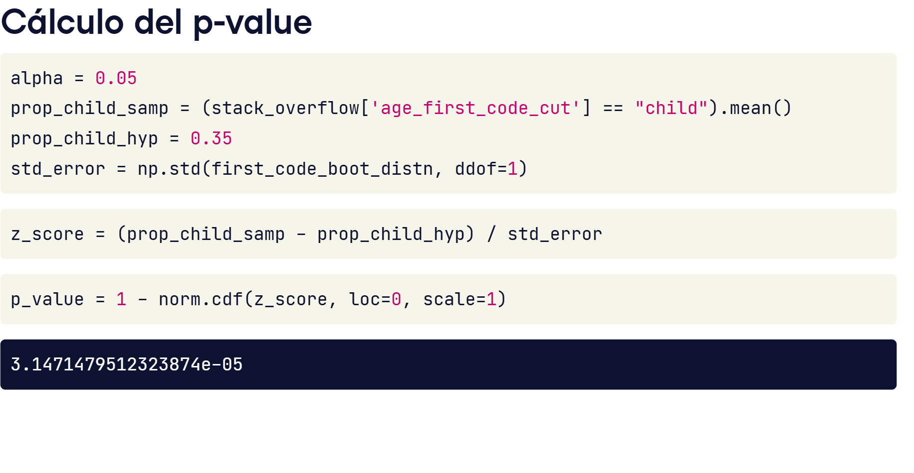
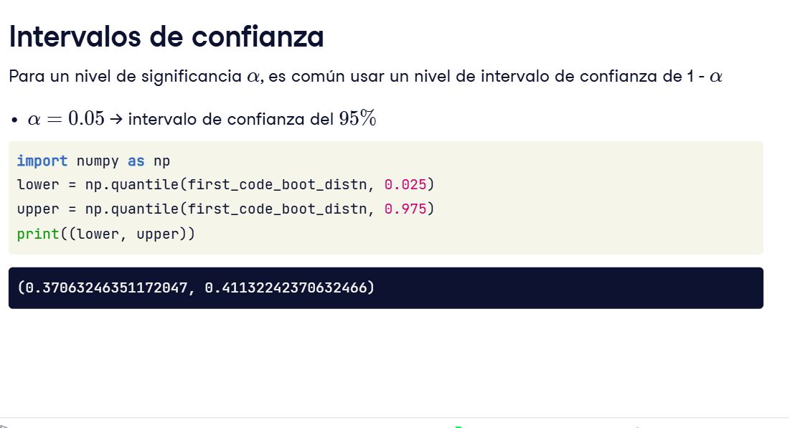

Los valores de p grandes indican una falta de evidencia para la hipótesis alternativa y, en cambio, se apegan a la hipótesis nula supuesta. 

Los valores p pequeños nos hacen dudar de esta suposición original a favor de la hipótesis alternativa. 
¿qué define el punto de corte entre un valor p pequeño y uno grande?

## Nivel significativo
El punto de corte se conoce como nivel de significancia y se denomina alfa. 
El nivel de significancia adecuado depende del conjunto de datos y de la disciplina en la que se trabaja. El cinco por ciento es la opción más común.
El nivel de significancia nos da un proceso de decisión para qué hipótesis apoyar. 
Si el valor p es menor o igual a alfa, rechazamos la hipótesis nula. 
> si p <= alpha rechazamos la hipotesis nula

De lo contrario, no lo rechazamos. 
> si p >= alpha. No rechazamos la Hipotesis Nula
### OJO
***Es importante que decidamos cuál debe ser el nivel de significancia apropiado antes de realizar nuestra prueba. De lo contrario, existe la tentación de decidir un nivel de significancia que nos permita elegir la hipótesis que queremos.***

### Calculando el valor p

1- El flujo de trabajo comienza estableciendo el nivel de significancia
2- A continuación, calculamos la media muestral 
3- Asignamos la media hipotetica
4- Para la puntuación z, también necesitamos el error estándar, que obtenemos de la distribución bootstrap.
5- Luego calculamos la puntuación z utilizando la media muestral, la media hipotética y el error estándar, y utilizamos el CDF normal estándar para obtener el valor p.

### 6. Intervalos de confianza

Para tener una idea de los valores potenciales del parámetro poblacional, es común elegir un nivel de intervalo de confianza de uno menos el nivel de significancia. 
Para un nivel de significancia de un 5%, usaríamos un intervalo de confianza del 95 por ciento. 

El intervalo proporciona un rango de valores plausibles para la proporción poblacional de científicos de datos que programaron cuando eran niños.

### Tipos de errores
 
1- *Falso Positivo o error de tipo 1*
> Si apoyamos la hipótesis alternativa cuando la hipótesis nula era correcta, cometimos un error falso positivo. 
2- *Falso Negativo o error de tipo 2*
> Si apoyamos la hipótesis nula cuando la hipótesis alternativa era correcta, cometimos un error falso negativo. 
