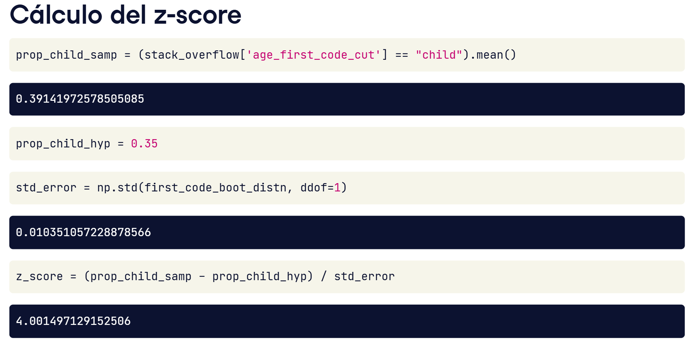
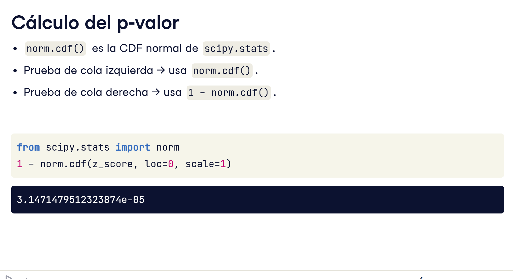

# Las pruebas de hipótesis son como los juicios penales.
> Hay dos posibles estados verdaderos: 
1- el acusado o bien cometió el delito, 
2- o no lo hizo. 

También hay dos posibles resultados: 
1- veredicto de culpable 
2- de no culpable.
La suposición inicial es que el acusado no es culpable, y el equipo de la acusación debe presentar pruebas más allá de toda duda razonable de que el acusado cometió el delito para que se dicte un veredicto de culpabilidad.

# Definiciones

Una hipótesis es una afirmación sobre un parámetro poblacional.
> No conocemos el valor verdadero de ese parámetro; solo podemos inferirlo a partir de los datos. 
Las pruebas de hipótesis comparan dos hipótesis enfrentadas. 
1-la hipótesis nula o H-nulo
> que representa la idea existente
2- la hipótesis alternativa o  H-A
> que plantea una idea nueva que la cuestiona. 

Nota: "Naught" es inglés británico para "cero". Por razones históricas, "H-naught" es la convención internacional para pronunciar la hipótesis nula.

## Volviendo a la comparación con el juicio penal:
 ´´´
 el acusado puede ser culpable o no culpable y, del mismo modo, solo una de las hipótesis puede ser verdadera. Inicialmente, se presume que el acusado no es culpable y, de forma análoga, partimos de que la hipótesis nula es cierta. Esto solo cambia si la muestra aporta pruebas suficientes para rechazarla. En lugar de decir que aceptamos la hipótesis alternativa, por convención hablamos de rechazar la hipótesis nula o de no poder rechazar la hipótesis nula. Si la evidencia está "más allá de toda duda razonable" de que el acusado cometió el delito, entonces se emite un veredicto de "culpable". El equivalente en pruebas de hipótesis de "más allá de toda duda razonable" se denomina nivel de significación
 ´´´ 
## Colas
Las colas de una distribución son los extremos izquierdo y derecho de su F-D-P. 
Las pruebas de hipótesis determinan si las estadísticas muestrales caen en las colas de la distribución nula, que es la distribución de la estadística si la hipótesis nula fuera cierta. 
## Tipos de pruebas
Hay tres tipos de pruebas, y la formulación de la hipótesis alternativa determina cuál debemos usar. 
1- Si comprobamos si hay una diferencia respecto a un valor hipotetizado, buscamos valores extremos en cualquiera de las dos colas y realizamos una prueba de dos colas. 
2- Si la hipótesis alternativa usa términos como "menor" o "inferior", hacemos una prueba de cola izquierda. 
3- Palabras como "mayor" o "supera" corresponden a una prueba de cola derecha. 

## valores p
Los valores p miden la solidez del apoyo a la hipótesis nula; en otras palabras, miden la probabilidad de obtener un resultado asumiendo que la hipótesis nula es cierta. 
1- Valores p grandes indican que nuestra estadística está dando un resultado que probablemente no está en una cola de la distribución nula, y el azar podría explicar bien el resultado. 
2- Valores p pequeños indican que nuestra estadística está dando un resultado probablemente en la cola de la distribución nula. 

Como los valores p son probabilidades, siempre están entre cero y uno.

## Calculo del z-score

Para calcular el valor p, primero debemos calcular la puntuación z. 
1- Calculamos la estadística muestral, en este caso la proporción de personas científicas de datos que empezaron a programar en la infancia. 
2- El valor hipotetizado por la hipótesis nula es del treinta-y-cinco por ciento. 
3- Obtenemos el error estándar a partir de la desviación estándar de la distribución bootstrap, y la puntuación z es la diferencia entre las proporciones, dividida por el error estándar.

## Cálculo del p-valor

Pasamos la puntuación z a la F-D-A normal estándar, 
norm-punto-cdf, de scipy-punto-stats con los valores predeterminados de media cero y desviación estándar uno. 
Como estamos realizando una prueba de cola derecha, no de cola izquierda, el valor p se calcula restando a uno el resultado de norm-punto-cdf. El valor p es tres de cada cien-mil.